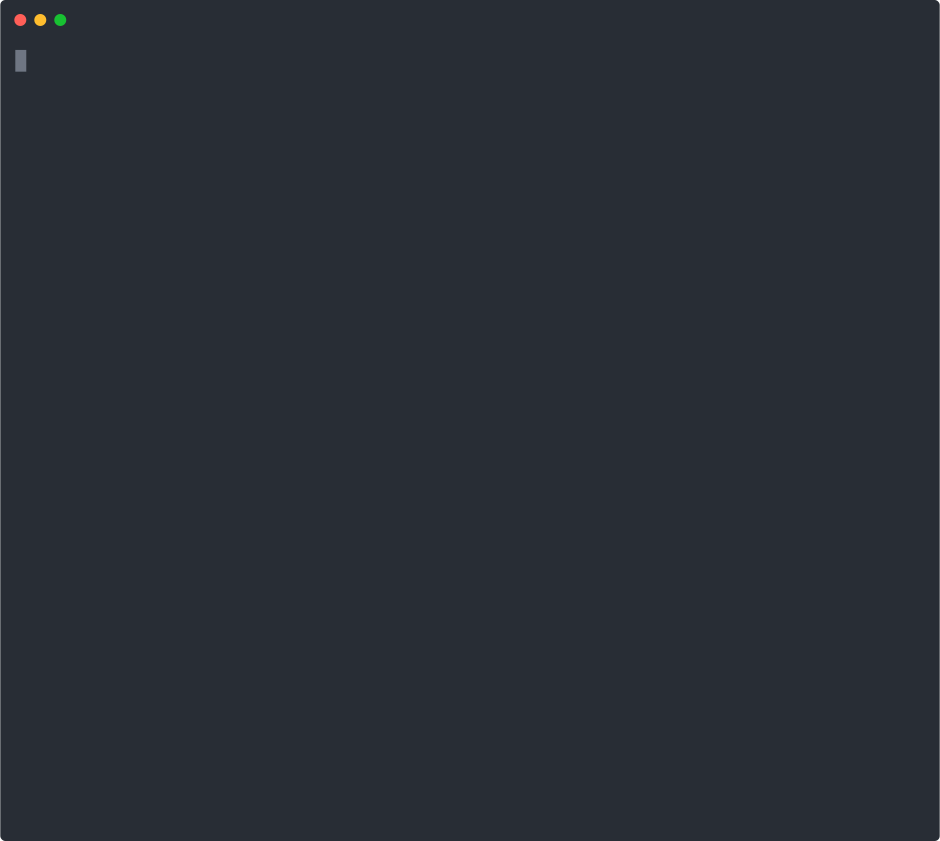

<div align="center">

# ysgen

**Turn any YouTube channel into Claude Code Skills — one command**

[](https://www.typescriptlang.org/)
[](https://bun.sh)
[](https://aistudio.google.com)
[](https://anthropic.com)
[](./LICENSE)

<br/>



</div>

---

Point `ysgen` at any YouTube channel, playlist, or video. It fetches transcripts, runs them through Gemini or Claude, and writes structured [`SKILL.md`](https://docs.anthropic.com/en/docs/claude-code/skills-and-workflows) files ready to drop into `~/.claude/skills/`.

Not summaries — **decision frameworks, step-by-step procedures, checklists** extracted from how the creator actually works.

```
YouTube  →  Transcripts  →  Corpus  →  Gemini / Claude  →  SKILL.md
```

---

## Quickstart

```bash
git clone https://github.com/glamgarondiscord/youtube-skills-gen
cd youtube-skills-gen
bun install
cp .env.example .env   # fill in your API keys
bun start              # interactive wizard
```

---

## Usage

```bash
# Channel
ysgen generate --channel https://www.youtube.com/@fireship

# With options
ysgen generate --channel https://www.youtube.com/@fireship \
  --provider claude \
  --max-videos 30 \
  --max-skills 5 \
  --install

# Playlist or individual videos
ysgen generate --playlist https://www.youtube.com/playlist?list=PLxxx
ysgen generate --video https://youtu.be/abc123 --video https://youtu.be/def456
```

---

## Commands

| Command | Description |
|---------|-------------|
| `ysgen generate` | Generate skills from a channel / playlist / video |
| `ysgen fetch` | Pre-fetch & cache transcripts without generating |
| `ysgen list` | List all previously generated skill sets |
| `ysgen update <dir>` | Pull new videos into an existing skill set |
| `ysgen regenerate <dir>` | Re-run LLM from cached transcripts (no network) |
| `ysgen inspect` | Cache stats and management |

### `generate` flags

```
Input:
  -c, --channel <url>          YouTube channel URL
  -p, --playlist <url>         YouTube playlist URL
  -v, --video <url...>         One or more video URLs
  -i, --interactive            Launch the wizard

Output:
  -o, --output <dir>           Output directory  (default: ./output)
      --install                Auto-copy skills to ~/.claude/skills/
      --output-lang <lang>     Skill language: en, fr, de, es, ja…

LLM:
      --provider <name>        gemini (default) | claude

Filters:
      --max-videos <n>         Videos to process (0 = all)
      --max-skills <n>         Skills to generate (default: 5)
      --min-views <n>          Skip videos with fewer views
      --since <date>           Only videos after YYYY-MM-DD
      --exclude-shorts         Skip YouTube Shorts
      --no-cache               Bypass transcript cache
```

---

## API Keys

| Key | Required for |
|-----|-------------|
| `GEMINI_API_KEY` | Always — get it at [aistudio.google.com](https://aistudio.google.com/app/apikey) |
| `YOUTUBE_API_KEY` | Channels & playlists — [Google Cloud Console](https://console.cloud.google.com/apis/api/youtube.googleapis.com) |
| `ANTHROPIC_API_KEY` | `--provider claude` only — [console.anthropic.com](https://console.anthropic.com) |

---

## Output structure

```
output/
└── fireship-skills-2025-01-15/
    ├── frontend-performance/
    │   └── SKILL.md
    ├── web-security-fundamentals/
    │   └── SKILL.md
    ├── system-design-patterns/
    │   └── SKILL.md
    └── manifest.json
```

Install generated skills:

```bash
# Auto (--install flag or wizard)
ysgen generate --channel <url> --install

# Manual
cp -r ./output/my-skills/* ~/.claude/skills/          # macOS / Linux
xcopy /E /I /Y "output\my-skills\*" "%USERPROFILE%\.claude\skills\"  # Windows
```

Then use in Claude Code: `/<skill-name>`

---

## Architecture

```
src/
├── providers/youtube/     URL resolution, Data API v3, video listing
├── extractors/            Transcript fetch + metadata
├── normalizers/           Noise removal, near-dedup (Jaccard shingles)
├── chunkers/              Token-aware corpus bin-packing
├── llm/                   Gemini + Claude providers, prompts
├── skill-generator/       Orchestration, validation, SKILL.md writer
├── storage/               TTL disk cache (per-video JSON)
├── pipeline/              End-to-end orchestrator
└── cli/                   Commands, wizard UI, display
```

**Data flow**

```
URL → resolve → list videos → fetch transcripts (cached)
    → normalize → deduplicate → build corpus
    → LLM pass 1: identify skill clusters
    → LLM pass 2: generate SKILL.md per cluster (parallel)
    → write output + manifest.json
```

---

## License

MIT
